# NexGate - Social Commerce Platform

A scalable social commerce platform built with Spring Boot microservices architecture.

## 🏗️ Architecture Overview

```mermaid
graph TB
    subgraph "Frontend Layer"
        WEB[Web App]
        MOBILE[Mobile App]
    end

    subgraph "Spring Boot Microservices"
        AUTH[🔐 Authentication Service<br/>:8080]
        USER[👤 User Service<br/>:8081] 
        COMMERCE[🛒 Commerce Service<br/>:8082]
        SOCIAL[📱 Social Service<br/>:8083]
        NOTIFICATION[📧 Notification Service<br/>:8084]
        FILE[📁 File Service<br/>:8085]
    end

    subgraph "Infrastructure"
        POSTGRES[(PostgreSQL)]
        REDIS[(Redis)]
        MINIO[(MinIO)]
        VAULT[🔐 Vault]
        EUREKA[🎯 Eureka]
        KAFKA[📨 Kafka]
    end

    WEB -.-> AUTH
    WEB -.-> USER
    WEB -.-> COMMERCE
    WEB -.-> SOCIAL
    
    MOBILE -.-> AUTH
    MOBILE -.-> USER
    MOBILE -.-> COMMERCE

    USER --> AUTH
    COMMERCE --> USER
    SOCIAL --> USER
    NOTIFICATION --> USER

    AUTH --> POSTGRES
    AUTH --> REDIS
    AUTH --> VAULT
    
    USER --> POSTGRES
    USER --> MINIO
    
    COMMERCE --> POSTGRES
    SOCIAL --> POSTGRES
    FILE --> MINIO

    AUTH --> EUREKA
    USER --> EUREKA
    COMMERCE --> EUREKA
    SOCIAL --> EUREKA
    NOTIFICATION --> EUREKA
    FILE --> EUREKA

    SOCIAL --> KAFKA
    NOTIFICATION --> KAFKA

    style AUTH fill:#e3f2fd
    style USER fill:#f3e5f5
    style COMMERCE fill:#e8f5e8
    style SOCIAL fill:#fff3e0
    style NOTIFICATION fill:#fce4ec
    style FILE fill:#f1f8e9
```



## 🛠️ Technology Stack

| Component | Technology | Purpose |
|-----------|------------|---------|
| **Backend** | Spring Boot 3.5.5, Java 24 | Microservices framework |
| **Database** | PostgreSQL | Primary data storage |
| **Caching** | Redis | Session management, caching |
| **File Storage** | MinIO | S3-compatible object storage |
| **Security** | HashiCorp Vault, JWT | Secret management, authentication |
| **Service Discovery** | Netflix Eureka | Service registration/discovery |
| **Messaging** | Apache Kafka | Event streaming |
| **Communication** | OpenFeign, RestTemplate | Inter-service communication |

## 🔐 Security Architecture

- **Secret Management**: All credentials stored in HashiCorp Vault
- **Authentication**: JWT tokens with OTP verification
- **Authorization**: Role-based access control (RBAC)
- **Password Security**: BCrypt hashing with complexity rules
- **Rate Limiting**: Built-in request throttling

```
Vault Structure:
├── secret/nexgate/database/
├── secret/nexgate/jwt/
├── secret/nexgate/email/
└── secret/nexgate/minio/
```

## 📁 File Storage System

- **MinIO**: S3-compatible object storage
- **Organization Buckets**: `org-{uuid}` pattern
- **Presigned URLs**: Secure direct upload/download
- **Auto-provisioning**: Bucket creation on user registration

## 🔄 Inter-Service Communication

```java
// Service Discovery
@EnableEurekaClient
@SpringBootApplication
public class UserServiceApplication

// Inter-service calls
@FeignClient(name = "authentication-service")
public interface AuthServiceClient {
    @GetMapping("/users/{id}")
    User getUserById(@PathVariable String id);
}
```

## 🚀 Quick Start

```bash
# Start infrastructure
docker-compose up -d

# Configure Vault secrets
vault kv put secret/nexgate/database url=jdbc:postgresql://localhost:5432/nexgate

# Run services
./mvnw spring-boot:run -Dspring-boot.run.arguments=--server.port=8080
```

## 📚 API Documentation

Complete API documentation: **[NexGate API Docs](https://developmet-space.gitbook.io/nexgate-api)**

---

**Current Status**: Active Development  
**Architecture**: Spring Boot Microservices  
**API Version**: 1.0
